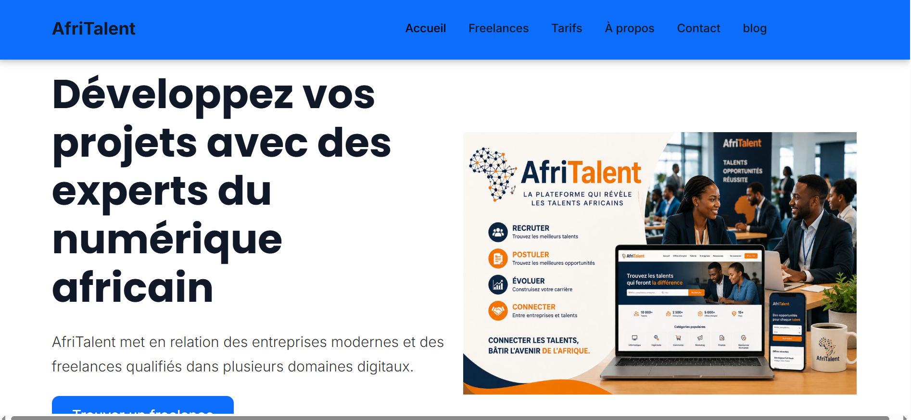
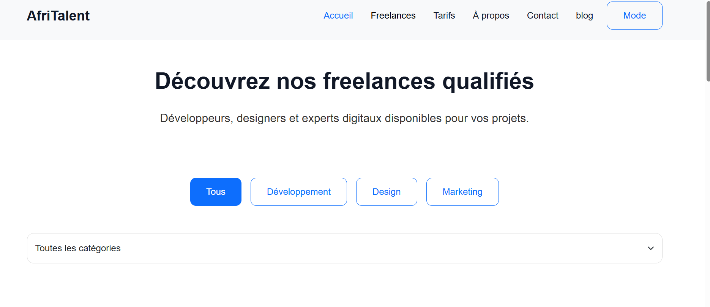
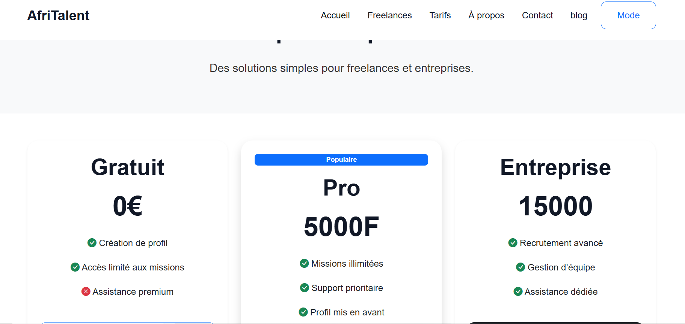
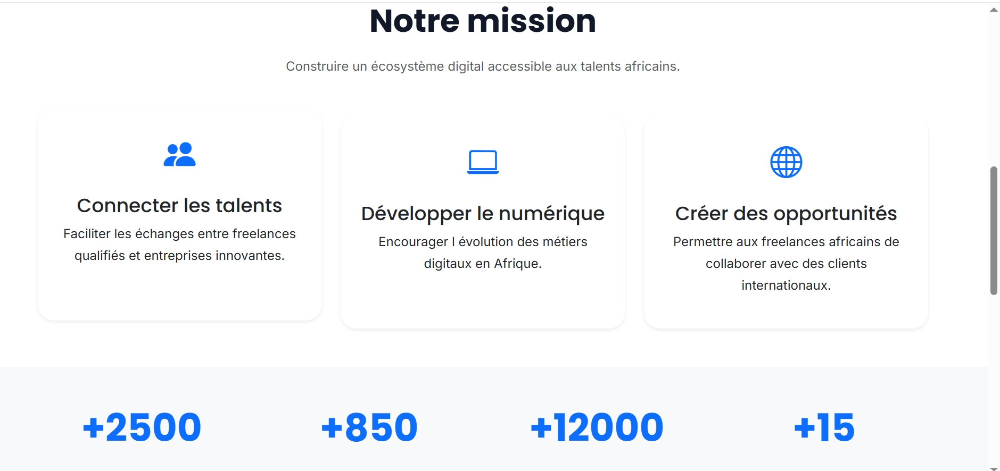
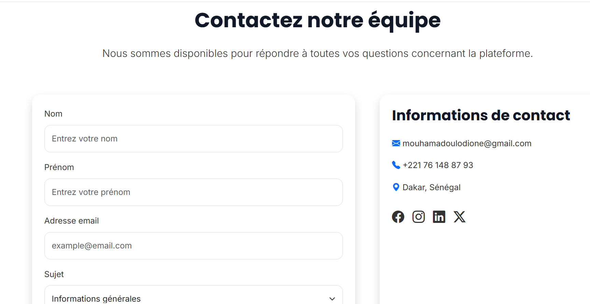
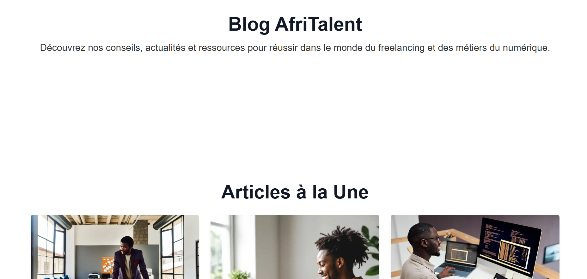

# AfriTalent 
Projet fil rouge — Plateforme de mise en relation entre freelances africains et 
clients. 
Auteur : Mohamadou lo DIONE
Promotion : L1 IAGE — ISI 
# AfriTalent

## Description

AfriTalent est une plateforme qui met en relation les entreprises et les freelances africains.

## Technologies utilisées:

* HTML
* CSS
* Bootstrap
* JavaScript

## Fonctionnalités:

* Page d'accueil
* Freelances
* Tarifs
* Blog
* Contact
* Dark Mode

## Ressources consultées:

* YouTube
* Google
* Bootstrap
* ChatGPT

# Structure du projet:

AfriTalent/ 
|
├── index.html 
├── freelances.html 
├── tarifs.html 
├── about.html 
├── contact.html 
├── css/ 
|   └── style.css 
|
├── js/ 
│   └── main.js 
|
├── images/ 
|   └── ---
|
├── docs/ 
|   └── NOM_Prenom_Presentation.pptx
|
└── README.md 

# Lien vers le site:
 https://mouhamadoulodione.github.io/MOUHAMADOU-DIONE-AfriTalent/ 

## capture d'ecran:

## Année universitaire

2025-2026

